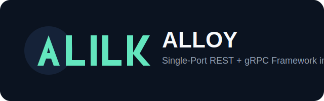

# Alloy



Alloy is a Rust server framework focused on **FastAPI-like developer ergonomics** with **single-port REST + gRPC** delivery.

## What You Get

- Single listener for REST (HTTP/1.1) and gRPC (HTTP/2)
- REST OpenAPI + Swagger UI:
  - `/openapi.json`
  - `/docs`
- gRPC contract bridge docs:
  - `/grpc/contracts` (rendered HTML)
  - `/grpc/contracts.md` (raw markdown)
  - `/grpc/contracts/openapi.json`
- REST SSE stream:
  - `/events`
- REST WebSocket echo:
  - `/ws`
- Optional REST auth-protected route:
  - `/protected/whoami`
- Fluent server builder API:
  - `AlloyServer::new().with_...().run()`
- Depends-style DI extractor with request cache:
  - `alloy_server::di::Depends<T>`
- Shared middleware stack:
  - tracing, request-id propagation, CORS, timeout, concurrency limit

## Quick Start (5 Minutes)

### 1) Start the default server

```bash
cargo run -p alloy-server
```

Default address: `127.0.0.1:3000`  
Override with:

```bash
ALLOY_SERVER_ADDR=127.0.0.1:4000 cargo run -p alloy-server
```

### 2) Verify REST

```bash
curl -s http://127.0.0.1:3000/health
curl -s http://127.0.0.1:3000/hello/Rust
curl -N http://127.0.0.1:3000/events
# ws check (requires websocat): websocat ws://127.0.0.1:3000/ws
```

WebSocket defaults:
- max text frame: `4096` bytes (`ALLOY_WS_MAX_TEXT_BYTES`)
- idle timeout: `45` seconds (`ALLOY_WS_IDLE_TIMEOUT_SECS`)

Auth defaults:
- disabled by default (`ALLOY_AUTH_ENABLED=false`)
- when enabled, JWT HMAC secret required (`ALLOY_AUTH_JWT_SECRET`)
- optional issuer/audience checks:
  - `ALLOY_AUTH_ISSUER`
  - `ALLOY_AUTH_AUDIENCE`
- `/protected/whoami` behavior:
  - auth disabled: returns `200` with anonymous principal
  - auth enabled: requires bearer JWT and returns `401` when missing/invalid

### 3) Open docs

- Swagger UI: [http://127.0.0.1:3000/docs](http://127.0.0.1:3000/docs)
- OpenAPI JSON: [http://127.0.0.1:3000/openapi.json](http://127.0.0.1:3000/openapi.json)
- gRPC contracts (rendered): [http://127.0.0.1:3000/grpc/contracts](http://127.0.0.1:3000/grpc/contracts)
- gRPC contracts (markdown): [http://127.0.0.1:3000/grpc/contracts.md](http://127.0.0.1:3000/grpc/contracts.md)
- gRPC OpenAPI bridge: [http://127.0.0.1:3000/grpc/contracts/openapi.json](http://127.0.0.1:3000/grpc/contracts/openapi.json)

## Repository Layout

```text
crates/alloy-core     # domain, state, error model
crates/alloy-rpc      # proto, tonic codegen, grpc-docgen tool
crates/alloy-server   # REST + gRPC routing, middleware, builder API
examples/simple-server
examples/renamed-alloy-app
docs/
scripts/
```

## FastAPI-Like Builder Example

```rust
use std::net::SocketAddr;

use alloy_server::AlloyServer;

#[tokio::main]
async fn main() -> Result<(), Box<dyn std::error::Error>> {
    AlloyServer::new()
        .with_addr(SocketAddr::from(([127, 0, 0, 1], 3000)))
        .run()
        .await?;
    Ok(())
}
```

See:
- `docs/fastapi-like-builder.md`
- `examples/simple-server/src/main.rs`
- `examples/renamed-alloy-app/src/main.rs` (dependency-rename-safe macro usage)

## gRPC Contract Doc Generation

Generate artifacts:

```bash
./scripts/generate_grpc_contract_docs.sh
```

Check drift (used in CI):

```bash
./scripts/check_grpc_contract_docs.sh
```

## CI And Local Verification

Local equivalent of CI:

```bash
./scripts/ci_local.sh
```

This runs:
- `cargo check --workspace`
- `cargo test --workspace`
- REST+gRPC multiplexing integration test
- gRPC docs drift check
- OpenAPI route check

## Current Status

Core roadmap items are implemented:
- `#1` to `#10` complete
- `#19` descriptor-based gRPC docs generator complete

Follow-up improvements continue via GitHub issues on:
[jaeyoung0509/alloy](https://github.com/jaeyoung0509/alloy)
